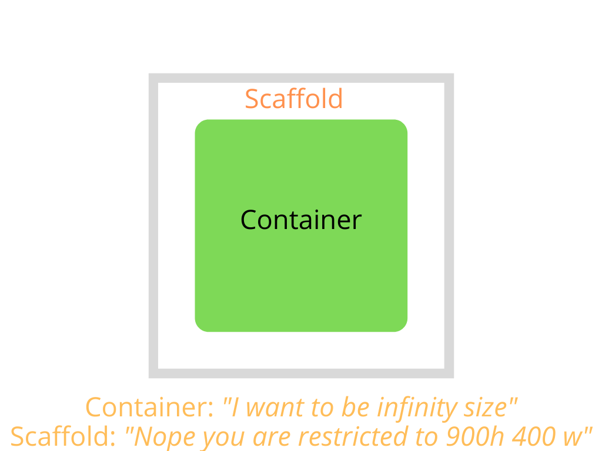
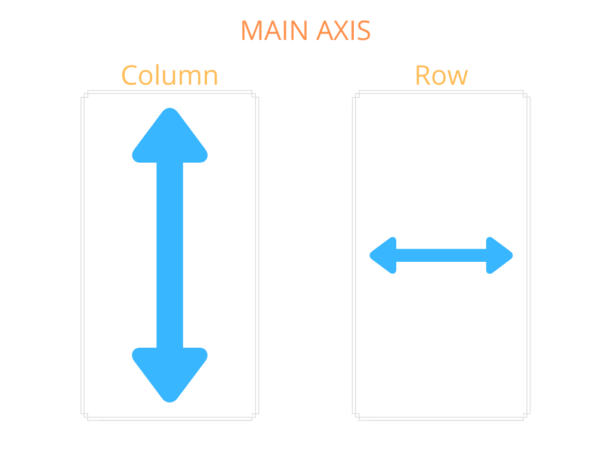
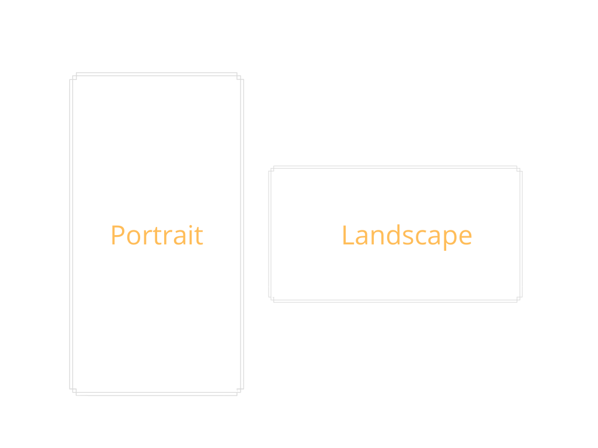
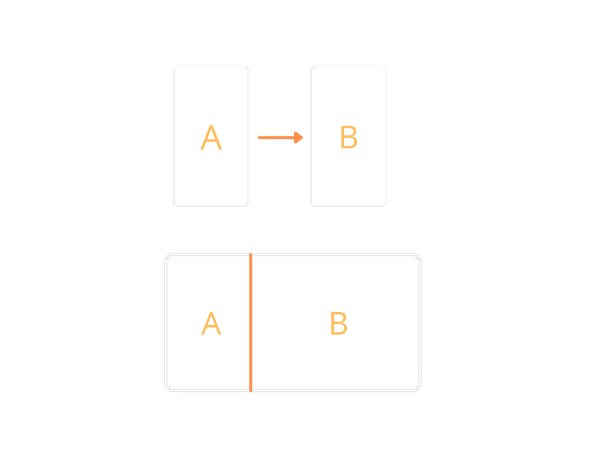

**NOTE: Everything in this repo falls under the GPL 3 license EXCEPT THE IMAGES IN README!** This is becaue of the tool used to create them.
<br/>
# Creating Responsive Apps With Flutter

- [Creating Responsive Apps With Flutter](#creating-responsive-apps-with-flutter)
  - [1.1. Box Contraints](#11-box-contraints)
  - [1.2. Responsiveness on Mobile Screens](#12-responsiveness-on-mobile-screens)
    - [1.2.1. Columns](#121-columns)
    - [1.2.2. Handling Orientation](#122-handling-orientation)
  - [1.3. Handling Wider Screens](#13-handling-wider-screens)
    - [1.3.1. Layout Builder](#131-layout-builder)
    - [1.3.2. MediaQuery](#132-mediaquery)

## 1.1. Box Contraints

Flutter framework is constraint based framework, i.e, a widget bounds is constrained by the parent widget. If, for example, you have a container has a dimension of height 900px and width 500px but when you run the code on your simulator, you see that its actually smaller than what you have intended to, this is due to the box constraints coming in from the parent widget which passes contraints of maybe 800px 400px. If the parent of the container is a scaffold, then the box constraint coming in from the scaffold to the container would be the screen dimensions. Box contraints are passed automatically by the parent.



<br/>

<details>
  <summary>Example 1 - Scaffold -> Container</summary>

<p>

```dart
import 'package:flutter/material.dart';
import 'package:flutter/widgets.dart';

class Example1 extends StatelessWidget {
  const Example1({Key key}) : super(key: key);

  @override
  Widget build(BuildContext context) {
    //Scaffold passes down screen dimensions as constraints  
    return Scaffold(
      appBar: AppBar(
        title: Text('Example 1'),
      ),
      body: Container(
        color: Colors.green,
        width: double.infinity,
        height: double.infinity,
      ),
    );
  }
}
```
</p>
</details>

<details>
  <summary>Example 2 - Scaffold -> Container 1 -> Container 2</summary>

<p>

```dart
import 'package:flutter/material.dart';
import 'package:flutter/widgets.dart';

class Example2 extends StatelessWidget {
  const Example1({Key key}) : super(key: key);

  @override
  Widget build(BuildContext context) {
    //Scaffold passes down screen dimensions as constraints
    return Scaffold(
      appBar: AppBar(
        title: Text('Example 1'),
      ),
      body: Container(
        width: 200,
        height: 200,
        child: Container(
          color: Colors.green,
          width: double.infinity,
          height: double.infinity,
        ),
      ),
    );
  }
}
```
</p>
</details>

<br/>

*"A widget can decide its own size only within the constraints given to it by its parent. This means a widget usually can’t have any size it wants."*

Notes:
- A parent can pass inifinity constraints to its child
- Use ConstrainedBox to pass constraints to child in your custom widgets
- You can check the constraints coming from parent from dev tools for debugging.

Additional Reading:
- [Box Constraints 101](https://marsgoat.medium.com/flutter-box-constraints-101-the-basics-bd0babe650f9)
- [Understanding Constraints](https://flutter.dev/docs/development/ui/layout/constraints)
- [ConstrainedBox](https://api.flutter.dev/flutter/widgets/ConstrainedBox-class.html)

## 1.2. Responsiveness on Mobile Screens
When creating an app across various mobile screen, we want to make sure they are responsive and expand or collapse based on the screen dimensions. So we will look at how to achieve that with Columns and Rows.



<br/>

### 1.2.1. Columns

So, Columns, unlike Scaffold or Container don't pass constraint along the main axis and will build the height from the children. This is because Columns children are dynamic.

<details>
  <summary>Example 1 - Unresponsive Overflow</summary>

<p>

```dart
import 'package:flutter/material.dart';
import 'package:flutter/widgets.dart';

class ColumnExample1 extends StatelessWidget {
  const ColumnExample1({Key key}) : super(key: key);

  @override
  Widget build(BuildContext context) {
    return Scaffold(
      appBar: AppBar(
        title: Text('Example 1'),
      ),
      //if the containers height are infite here, the app will //crash
      body: Column(
        children: [
          Container(
            color: Colors.green,
            height: 100,
          ),
          Container(
            color: Colors.blue,
            height: 300,
          ),
          Container(
            color: Colors.orange,
            height: 1000,
          ),
        ],
      ),
    );
  }
}
```
</p>
</details>

As you saw with the example, the overflow error generally happens with Columns and Rows because they don't pass constraint to the children along the main axis to restric the child's height.

<details>
  <summary>Example 2 - Unresponsive Unused Space</summary>

<p>

```dart
import 'package:flutter/material.dart';
import 'package:flutter/widgets.dart';

class ColumnExample1 extends StatelessWidget {
  const ColumnExample1({Key key}) : super(key: key);

  @override
  Widget build(BuildContext context) {
    return Scaffold(
      appBar: AppBar(
        title: Text('Example 1'),
      ),
      //if the containers height are infite here, the app will //crash
      body: Column(
        children: [
          Container(
            color: Colors.green,
            height: 100,
          ),
          Container(
            color: Colors.blue,
            height: 300,
          ),
          Container(
            color: Colors.orange,
            height: 100,
          ),
        ],
      ),
    );
  }
}
```
</p>
</details>

Here, there is unused space. The dimensions could work for one mobile device but not for others as
different mobile devices have different heights.

So how do we solve the problem of widgets going out of bounds? We use a special widget called **Expanded** or **Flexible**. These widgets can only be used by Columns or Rows.

**Expanded** will fill the remaining space with the child widget, which in our case is the orange widget. Note that when using Expanded, it will completely ignore the child's height.

<details>
  <summary>Example - Responsive With Expanded</summary>

<p>

```dart
import 'package:flutter/material.dart';
import 'package:flutter/widgets.dart';

class ColumnExampleResponsive extends StatelessWidget {
  const ColumnExampleResponsive({Key key}) : super(key: key);

  @override
  Widget build(BuildContext context) {
    return Scaffold(
      appBar: AppBar(
        title: Text('Example 1'),
      ),
      body: Column(
        children: [
          Container(
            color: Colors.green,
            height: 100,
          ),
          Container(
            color: Colors.blue,
            height: 300,
          ),
          Expanded(
            child: Container(
              color: Colors.orange,
              height: 500,
            ),
          ),
        ],
      ),
    );
  }
}
```
</p>
</details>

Notes:
- Rows is pretty similar to Column, except that the main axis is controlled by width.
- Use Flex widget if you want dynamic control, i.e, switch between Column and Row.
- **Flexible** is similar to **Expanded** but with more options on the Columns on how children should take up space.
- Use **flex** attribute with Expanded to more fine grained control of the space taken by children

Additional Reading:
- [Columns & Rows Box Constraints](https://itnext.io/flutter-box-constraints-columns-rows-382dcf82256a)
- [Nested Columns & Rows Box Constraints](https://marsgoat.medium.com/flutter-box-constraints-nested-column-s-row-s-3dfacada7361)
- [Flex](https://api.flutter.dev/flutter/widgets/Flex-class.html)
- [Expanded](https://api.flutter.dev/flutter/widgets/Expanded-class.html)
- [Flexible](https://api.flutter.dev/flutter/widgets/Flexible-class.html)
- [Flexible vs Expanded](https://itnext.io/flutter-responsive-apps-flexible-vs-expanded-ff8cc92b468f)

### 1.2.2. Handling Orientation



<br/>

Notes:

- Use OrientationBuilder to know what the current orientation and return the respective widget
- Disable particular orientation

Additional Reading:
- [OrientationBuilder](https://api.flutter.dev/flutter/widgets/OrientationBuilder-class.html)
- [Flutter Docs Orientation](https://flutter.dev/docs/cookbook/design/orientation)

## 1.3. Handling Wider Screens

So for handling different mobile device screen, using Columns/Rows with Expanded is sufficient but to 
expand the repsonsiveness to wider screens like desktop apps and desktop browsers, we have to rely on 
either MediaQuery or LayoutBuilder.



<br/>

### 1.3.1. Layout Builder

Layout builder is similar to MediaQuery when it comes to screen sizes but it can used with any widget 
and get the parent constraints.

<details>
  <summary>Layout Builder Orientation Example</summary>

<p>

```dart
import 'package:flutter/material.dart';
import 'package:flutter/widgets.dart';

import '../responsive_util.dart';

class LayoutBuilderResponsive extends StatelessWidget {
  const LayoutBuilderResponsive({Key key}) : super(key: key);

  @override
  Widget build(BuildContext context) {
    return Scaffold(
      appBar: ResponsiveUtil.isWideScreen(context)
          ? null
          : AppBar(
              title: Text('LayoutBuilder Responsive'),
            ),
      body: LayoutBuilder(
        builder: (context, constraints) {
          return GridView.count(
            crossAxisCount: constraints.maxWidth < 500 ? 2 : 4,
            children: List.generate(100, (index) {
              return Container(
                child: Center(
                  child: Image.network(
                    'https://picsum.photos/id/${index + 400}/${constraints.maxWidth < 500 ? (constraints.maxWidth / 2).round() : (constraints.maxWidth / 4).round()}',
                    loadingBuilder: (BuildContext context, Widget child,
                        ImageChunkEvent loadingProgress) {
                      if (loadingProgress == null) return child;
                      return Center(
                        child: CircularProgressIndicator(),
                      );
                    },
                  ),
                ),
              );
            }),
          );
        },
      ),
    );
  }
}
```
</p>
</details>

### 1.3.2. MediaQuery

Using MediaQuery, you can get information like screen dimensions, accessibilty information which you can use to handle various screen sizes.

<details>
  <summary>Media Query Example Handling Orientation</summary>

<p>

```dart
import 'package:flutter/material.dart';
import 'package:flutter/widgets.dart';

import '../responsive_util.dart';

class MediaQueryResponsive extends StatelessWidget {
  const MediaQueryResponsive({Key key}) : super(key: key);

  @override
  Widget build(BuildContext context) {
    return Scaffold(
        appBar: ResponsiveUtil.isWideScreen(context)
            ? null
            : AppBar(
                title: Text('MediaQuery Responsive'),
              ),
        body: GridView.count(
          crossAxisCount: MediaQuery.of(context).size.width < 500 ? 2 : 4,
          children: List.generate(100, (index) {
            return Container(
              child: Center(
                child: Image.network(
                  'https://picsum.photos/id/${index + 100}/${MediaQuery.of(context).size.width < 500 ? (MediaQuery.of(context).size.width / 2).round() : (MediaQuery.of(context).size.width / 4).round()}',
                  loadingBuilder: (BuildContext context, Widget child,
                      ImageChunkEvent loadingProgress) {
                    if (loadingProgress == null) return child;
                    return Center(
                      child: CircularProgressIndicator(),
                    );
                  },
                ),
              ),
            );
          }),
        ));
  }
}

```
</p>
</details>

<details>
  <summary>Media Query Example Handling Companion App</summary>

<p>

```dart

class ResponsiveUtil {
  static final kBreakPoint = 800;

  static bool isWideScreen(BuildContext context) {
    return MediaQuery.of(context).size.width > kBreakPoint;
  }
}

class MyHomePage extends StatefulWidget {
  MyHomePage({Key key, this.title}) : super(key: key);

  final String title;

  @override
  _MyHomePageState createState() => _MyHomePageState();
}

class _MyHomePageState extends State<MyHomePage> {
  PageController _controller = PageController(
    initialPage: 0,
  );

  @override
  void dispose() {
    _controller.dispose();
    super.dispose();
  }

  @override
  Widget build(BuildContext context) {
    return Scaffold(
      appBar: AppBar(
        title: Text(widget.title),
      ),
      body: ResponsiveUtil.isWideScreen(context)
          ? SafeArea(
              child: Row(
                children: [
                  Container(
                    width: MediaQuery.of(context).size.width * .30,
                    child: ListView(
                      children: [
                        ListTile(
                          title: Center(
                            child: Text('OPTIONS'),
                          ),
                        ),
                        Divider(
                          color: Colors.orange,
                        ),
                        ListTileCustomWideScreen(
                            title: 'Box Constraint Examples',
                            onTap: () => _controller.page == 0
                                ? null
                                : _controller.animateToPage(0,
                                    duration: Duration(milliseconds: 500),
                                    curve: Curves.fastLinearToSlowEaseIn)),
                        Divider(
                          color: Colors.white,
                        ),
                        ListTileCustomWideScreen(
                            title: 'Columns & Rows',
                            onTap: () => _controller.page == 1
                                ? null
                                : _controller.animateToPage(1,
                                    duration: Duration(milliseconds: 500),
                                    curve: Curves.fastLinearToSlowEaseIn)),
                        Divider(
                          color: Colors.white,
                        ),
                        ListTileCustomWideScreen(
                            title: 'Media Query',
                            onTap: () => _controller.page == 2
                                ? null
                                : _controller.animateToPage(2,
                                    duration: Duration(milliseconds: 500),
                                    curve: Curves.fastLinearToSlowEaseIn)),
                        Divider(
                          color: Colors.white,
                        ),
                        ListTileCustomWideScreen(
                            title: 'Layout Builder',
                            onTap: () => _controller.page == 3
                                ? null
                                : _controller.animateToPage(3,
                                    duration: Duration(milliseconds: 500),
                                    curve: Curves.fastLinearToSlowEaseIn)),
                        Divider(
                          color: Colors.white,
                        )
                      ],
                    ),
                  ),
                  VerticalDivider(
                    color: Colors.grey,
                    indent: 0,
                    endIndent: 0,
                    thickness: 1,
                    width: 0.5,
                  ),
                  Expanded(
                      child: PageView(
                    physics: NeverScrollableScrollPhysics(),
                    pageSnapping: false,
                    controller: _controller,
                    children: [
                      BoxContraintExamples(),
                      ColumnExamples(),
                      MediaQueryResponsive(),
                      LayoutBuilderResponsive()
                    ],
                  ))
                ],
              ),
            )
          : SafeArea(
              child: ListView(
                children: [
                  ListTileCustom(
                      title: 'Box Constraint Examples',
                      screen: BoxContraintExamples()),
                  Divider(
                    color: Colors.white,
                  ),
                  ListTileCustom(
                      title: 'Columns & Rows', screen: ColumnExamples()),
                  Divider(
                    color: Colors.white,
                  ),
                  ListTileCustom(
                      title: 'Mobile Screen Orientation',
                      screen: OrientationExamples()),
                  Divider(
                    color: Colors.white,
                  ),
                  ListTileCustom(
                      title: 'Media Query', screen: MediaQueryResponsive()),
                  Divider(
                    color: Colors.white,
                  ),
                  ListTileCustom(
                      title: 'Layout Builder',
                      screen: LayoutBuilderResponsive()),
                  Divider(
                    color: Colors.white,
                  )
                ],
              ),
            ),
    );
  }
}


```
</p>
</details>

Notes:
- For fine grained control per widget on how it should be repsonsive, use LayoutBuilder
- MediaQuery also provides information related to accessibility and you can make changes to font size etc

Additional Reading:
- [MediaQuery](https://api.flutter.dev/flutter/widgets/MediaQuery-class.html)
- [LaytouBuilder](https://api.flutter.dev/flutter/widgets/LayoutBuilder-class.html)
